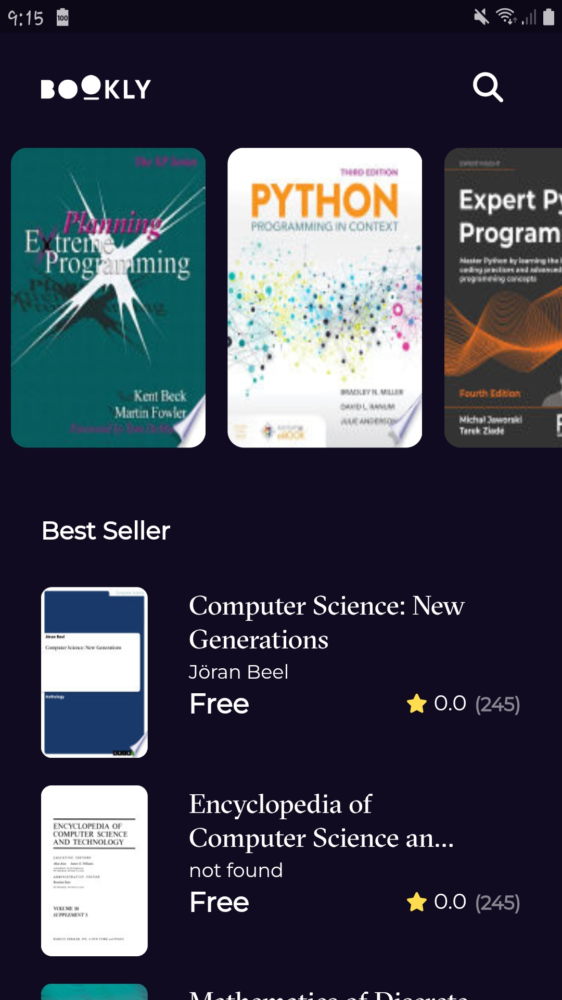

# Book Store App: ( Clean architecture ).

This project is powered by FLutter and dart.

# Screenshots:

<h3> 1- Home screen </h3>

<p align="center">
  
</p>

<h3> 2- Details screen </h3>

<p align="center">
  
</p>

# The main packages used in the project:

```yaml
dependencies:
  cached_network_image: ^3.2.3
  cupertino_icons: ^1.0.2
  dartz: ^0.10.1
  dio: ^5.3.2
  flutter:
    sdk: flutter
  flutter_bloc: ^8.1.3
  font_awesome_flutter: ^10.2.1

  get_it: ^7.6.0
  go_router: ^10.1.2
  google_fonts: ^4.0.4
  hive: ^2.2.3
  hive_flutter: ^1.1.0
  meta: ^1.8.0

dev_dependencies:
  build_runner: ^2.3.3
  flutter_lints: ^2.0.0
  flutter_test:
    sdk: flutter
  hive_generator: ^2.0.1
```

## How to Use

**Step 1:**

Download or clone this repo by using the link below:

```
https://github.com/osamasabry9/Book-Store-App.git
```

**Step 2:**

Go to project root and execute the following command in console to get the required dependencies:

```
flutter pub get
```

### Folder Structure

Here is the core folder structure which flutter provides.

```
flutter-app/
|- android
|- build
|- ios
|- lib
    |- app/
    |- core/
    |- features/
    |- main
```

Here is the folder structure we have been using in this project

```
lib/app/
       |- app/
       |- di/
lib/core/
       |- constants/
       |- errors/
       |- functions/
       |- use_case/
       |- utils/
       |- widgets/

lib/features/
       |- Home/
       |- search/
       |- splash/


 lib/features/Home/
       |- data/
       |- domain/
       |- presentation/

data/
       |- data_source/
       |- model/
       |- repository/
domain/
       |- entities/
       |- repository/
       |- usecase/
presentation/
       |- auth/
              |- cubit/
                      |- featured_books_cubit/
                      |- newest_books_cubit/
              |- Views/
                      |- book_details_view/
                      |- home_view/
              |- widgets/
```
